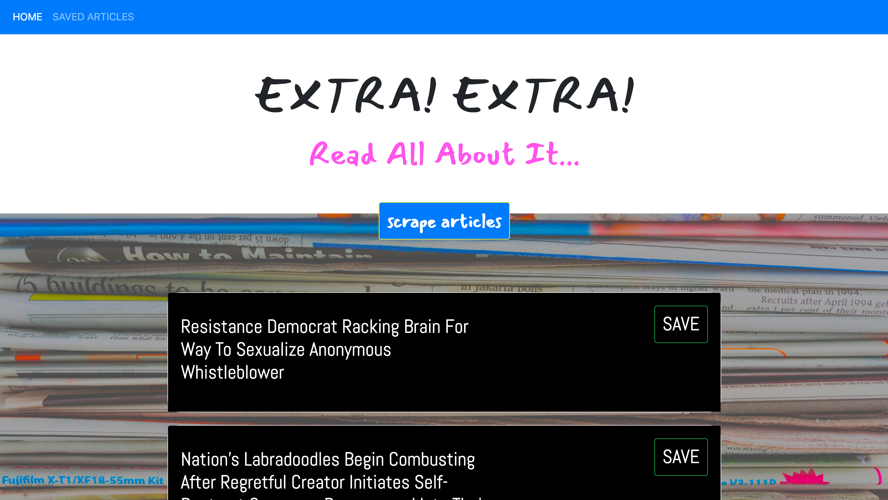

# inMongoNews

## Overview
In this assignment, you'll create a web app that lets users view and leave comments on the latest news. But you're not going to actually write any articles; instead, you'll flex your Mongoose and Cheerio muscles to scrape news from another site.

## Submission Requirements
* Github repository and deployed Heroku link 

## Basic Requirements 
Run npm init. When that's finished, install and save these npm packages:

express
express-handlebars
mongoose
cheerio
axios

## Screenshots and link to see how inMongoNews works 
*Going to the deployed heroku link: https://lasusan-friend-finder.herokuapp.com/home.html, you will see this home screen. Click"Scrape Article"to get new ones. 

